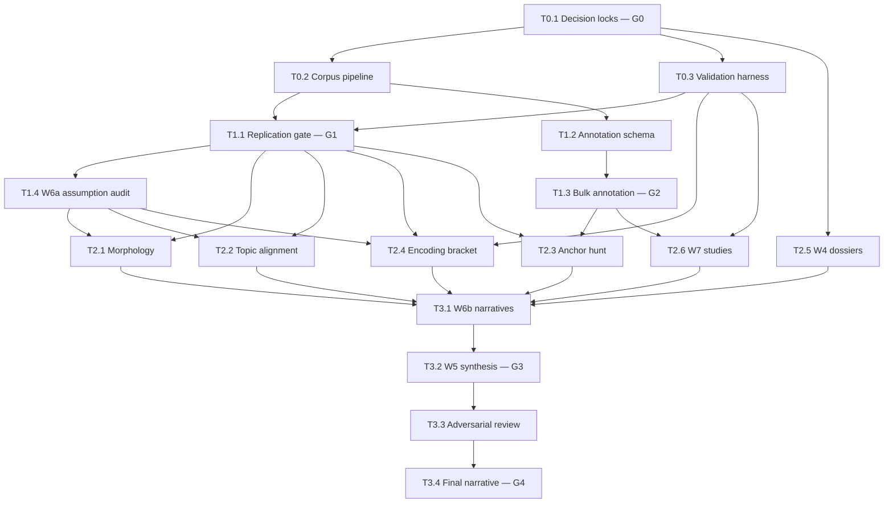

# WORKFLOW.md — Execution Plan

## 1. Execution model

Two surfaces, per Tim's standard split:

- **Claude Cowork (+ subagents)** — default surface. Research, schema design, annotation QA and adjudication, assumption audit, dossiers, narrative synthesis, interpretation of statistical outputs, adversarial-review orchestration.
- **Claude Code** — anything that produces or runs code. Corpus pipeline, harness generators, all statistics, annotation pipeline plumbing, discriminator implementations, replication gate.

**Spine principle (L3):** every statistic is computed by deterministic, versioned code in the repo. Models never estimate metrics in-context. Cowork sessions consume Code-produced result files; they do not recompute.

**Repo:** single repository (name pending D8). All outputs — data, results JSON, reports, dossiers — flow through it. Cowork and Code sessions share it as the source of truth.

## 2. Task table

| ID | Task | Inputs → Outputs | Depends on | Surface | Model | Gate |
|---|---|---|---|---|---|---|
| T0.1 | Decision locks: close D1 minimum; review all D-items | DECISIONS.md → updated ledger | — | Cowork + Tim | Fable 5 | **G0 (Tim)** |
| T0.2 | Corpus pipeline: acquire transliteration + scans, verify licensing (D10), page-level metadata join (section, Currier A/B, scribal hand), loaders, integrity checks | Sources → versioned dataset | T0.1 | Code | Fable 5 engine | — |
| T0.3 | Validation harness: reimplement Naibbe generator + self-citation generator, assemble control corpora, scoring API, benchmark report | Papers + D3 corpora → harness | T0.1 | Code | Fable 5 engine | — |
| T1.1 | Replication gate: h2, Zipf ×2, A/B split, Montemurro–Zanette metrics, positional effects vs. published values | T0.2 + T0.3 → replication report | T0.2, T0.3 | Code | Fable 5 engine | **G1 (Tim)** |
| T1.2 | Annotation schema design (D5 granularity) | Scans sample → schema + examples | T0.2 | Cowork | Fable 5 | — |
| T1.3 | Bulk annotation: pipeline (Code) + batch vision annotation of ~200+ illustrated pages (API) + QA sample review | T1.2 → annotated dataset | T1.2 | Code build; Cowork QA | Sonnet 4.6 bulk; Fable 5 QA; Haiku 4.5 format validation | **G2 (Tim)** |
| T1.4 | W6a assumption audit → Phase 2 variant matrix | Prior-art review → variant matrix | T1.1 | Cowork | Fable 5 (extended thinking) | — |
| T2.1 | Morphology + positional structure studies | T1.1 pipeline + T1.4 variants → report | T1.1, T1.4 | Code stats; Cowork interpretation | Fable 5 both | — |
| T2.2 | Topic induction + section-alignment test | Same → report | T1.1, T1.4 | Code stats; Cowork interpretation | Fable 5 both | — |
| T2.3 | **Anchor hunt** (highest ceiling): token-cluster × visual-feature co-occurrence | T1.3 + T1.1 → report | T1.1, T1.3 | Code stats; Cowork design + interpretation | Fable 5 both | — |
| T2.4 | Encoding-hypothesis bracket: five generative models scored on harness | T0.3 + T1.1 + T1.4 → report | T0.3, T1.1, T1.4 | Code | Fable 5 engine | — |
| T2.5 | W4 influence dossiers (5 dossiers, parallel subagents) | Research feature + web → sourced dossiers | T0.1 | Cowork subagents | Fable 5; Research feature | — |
| T2.6 | W7 studies: realism discriminator + anachronism scan (stats) + purpose essay | T1.3 + T0.3 + D11 catalogs → likelihood-ratio report + essay | T1.3, T0.3 | Code stats; Cowork essay + interpretation | Fable 5 both | — |
| T3.1 | W6b competing narratives + evidence board | All Phase 2 reports + T2.5 → narratives with evidence ledgers | All T2.x | Cowork | Fable 5 (long context) | — |
| T3.2 | W5 living synthesis with graded claims | T3.1 + all reports → flagship doc | T3.1 | Cowork | Fable 5 | **G3 (Tim)** |
| T3.3 | Adversarial review of all A/B-graded claims | T3.2 → critique log + revisions | T3.2 | Cowork orchestrating clean-context critics | Fable 5 fresh instances; optional second model family (D6) | — |
| T3.4 | Final narrative + write-up | T3.3 → final deliverable | T3.3 | Cowork | Fable 5 | **G4 (Tim)** |

## 3. DAG

**Parallel lanes after G1:** {T2.1, T2.2, T2.4} (text lane) · {T1.2→T1.3→T2.3, T2.6} (image lane) · {T2.5} (research lane, can start immediately after G0). Critical path: T0.1 → T0.2/T0.3 → T1.1 → T1.3-dependent tasks → T3.x.

## 4. Model routing rationale

- **Fable 5 via Claude Code** — all engineering. Most of the actual work by volume.
- **Fable 5 in Cowork** — schema design, hard-page vision adjudication, W6a/W6b (long-context synthesis + extended thinking is exactly its lane), W4 research, W7 essay, hypothesis generation from statistical outputs, final synthesis.
- **Sonnet 4.6 via API** — bulk multimodal annotation: consistency and cost dominate over brilliance at scale.
- **Haiku 4.5** — ETL glue, format validation, transcription-variant checks in batch.
- **Second model family (optional, D6)** — outside critic in T3.3 for decorrelated blind spots.
- **Tim** — gates G0–G4, annotation spot-checks, evidence-grade signoff.

## 5. QA protocol

- **Annotation:** Fable 5 reviews a random 10–15% sample of Sonnet 4.6 annotations per batch; disagreements adjudicated in Cowork; Tim spot-checks a small fixed subset each batch for drift. Batch fails if disagreement rate exceeds threshold (set at T1.2).
- **Code:** replication gate (G1) is the pipeline's integration test; harness generators validated against published statistical profiles of their papers before use.
- **Claims:** nothing graded A/B without passing T3.3 adversarial review (L10).

## 6. Session kickoff briefs

**Code session 1 — Foundation.** "Read README.md, DECISIONS.md, RESEARCH-PLAN.md §3, WORKFLOW.md T0.2–T0.3. Build the corpus pipeline and validation harness. Fetch and verify sources (flag licensing findings as D10 updates). Do not proceed past T1.1 without G1 signoff."

**Code session 2 — Phase 2 stats (post-G1).** "Read the replication report and T1.4 variant matrix. Implement T2.1/T2.2/T2.4 per RESEARCH-PLAN §4. Every experiment runs across the D1 sensitivity variants. Output results as versioned JSON + report per task."

**Cowork session 1 — Dossiers (post-G0).** "Read README.md and RESEARCH-PLAN §4-W4. Spin up one subagent per dossier (cipher culture, balneology, gynecological reading, astrological iconography, provenance chain). Sourced claims only; grade everything C or D; flag anything that needs a statistical test as a T2 candidate."

**Cowork session 2 — Assumption audit (post-G1).** "Read RESEARCH-PLAN §4-W6a and the replication report. Produce the assumption inventory and Phase 2 variant matrix. Extended thinking on; every variant must name the statistic that would move if the assumption is wrong."

**Cowork session 3 — Synthesis (post-Phase 2).** "Read all Phase 2 reports and dossiers. Execute T3.1 then T3.2 per P6: competing narratives, evidence ledgers, graded claims. Then orchestrate T3.3 with fresh critic instances that receive only the outputs, never this session's reasoning."

## 7. Definition of done

- **Phase 0:** dataset loads clean; harness benchmark report exists; G0 ledger updated.
- **Phase 1:** G1 replication report approved; G2 annotation dataset accepted; variant matrix delivered.
- **Phase 2:** every study has a versioned report with graded claims and harness-validation status.
- **Phase 3:** flagship narrative approved at G4; critique log resolved; approach-evaluation matrix populated.
